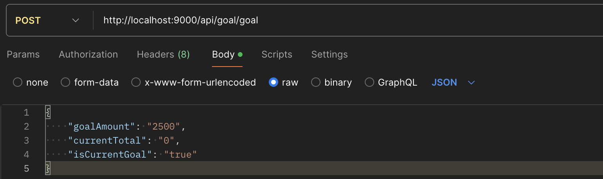
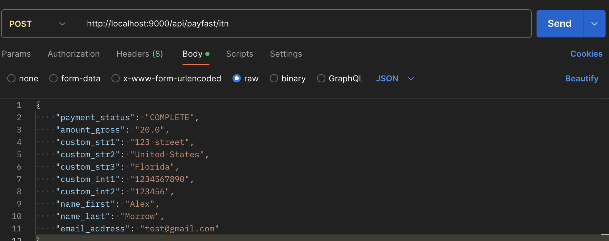

# donation-page

This documentation provides explanations on some of the more confusing parts of the codebase. We have also outlined what still needs to be done to make the website fully functional and deployed. Please read through it all, as it also contains information to ensure that the app runs properly during development.

## CurrencyExchange

### Backend

Update currency Exchange will fetch the current exchange rates from the mongoDB. If there are no exchange rates present or if they are over 12 hours old, then the controller will fetch new exchange rates from exchangeratesapi.io. Currently, the fetch call has a parameter called access_key which is tied to a free API key I generated by creating an account. If the key runs out of free calls (which it shouldnt because it should only fetch 60 times a month). Then just create an account yourself and substitute the API keys.

### Frontend

Each time the page is rendered, the exchangeRatesService calls the update route, this will either return the existing database entry, or overwrite the old entry then return the new one instead.

### Third Party API Notes

You may run into the issue that you run out of free API requests. Don't be suprised, it is because there are likely 4 of you that are working on your local computers, so that would be 8 API requests per day as opposed to the expected 2. If it happens, just create a new account and replace the API key with your new one.

### More Info

Read the exchangeratesapi docs to understand the structure of the response body and other additional information.

## Using Payfast API

The payfast api is encapsulated within the form in the paymentInfoCard component. When the button on this component is clicked, the information specified by the custom inputs is passed to the payfasy server, and the user is redirected to complete the transaction. Once the transaction is successful, the payfast servers send an API request to our local endpoint at /api/payfast/itn. The request body contains all of the custom information as well as the status of the transaction.

IMPORTANT - To test that the payfast/itn endpoint is receiving the correct info and is working properly, it must be exposed to the internet. Use [ngrok](https://ngrok.com/). When exposing this endpoint to the internet, be sure to replace the notify_url with the url that ngrok provides you with.

### Frontend

If you need to change the information required for the 18A receipt, all you need to do is include additional input fields that are tied to one of the custom_int's or custom_str's.

### Backend

Similar to the frontend, all you need to do to update the backend when changing this information is adjust how the backend receives the request body and creates database entries.

## Goals System

In order for the website to work properly, you must have a goal entry in the databse according to the structure of goalModel. Currently, there is no way to do this through the frontend, so it must be added to the database through postman.

## Other Notes

- We centralized all of our css into app.css, feel free to change this if you wish.
- Styles already exist for most coloring and button styling.
- Talk to Ruben and Yanga about any styling they want to add/change.

## Needs Work

### Exporting Data to Accountant

This is going to be one of the most predominant tasks of the project.
We did not have enough time to finish the exporting script, so it is untested and not good at handling cases when errors occur.

Also, establish _frequent_ and _constant_ communication with the accountant, Francois DuToit, as early on as possible. You will have to communicate with him to workout exactly how the data should be exported and sent to him.

### Admin Login and CRUD

As stated before, there is currently no way to change the goals tracker on the website, it can only be done through Postman. A good use of time would be creating an administrator login, then implementing CRUD for the goal tracker, so Ruben is able to change the goal total, current total, or anything else about the goal tracker that he would want.

You could probably copy most of this functionality from the blog app and only need to make minor changes.

### Security

Currently, anyone who knows what to type in could update our databases by typing in the url bar. The endpoints should be secured based on the context. For example, the goals create, update, and delete endpoints should only be accessibly by the admin user. Look into the payfast docs to research how to ensure the request to the payfast/itn endpoint is sent by their servers.

### Deployment

Ultimately the goal is to deploy the website by the end of session 2. Speak with Jeffrey early on about what service, domain name, etc should be used for deployment

### Other Things

- currencies being consistent on the page, especially donation messages which are currently in ZAR & also making sure they are round numbers
- shop and contact links are broken in the header
- entire app needs to be rigorously tested for bugs & handle any sort of error
- make the donation box have some type of animation when it populates after clicking donate $25 or any amount

## Running the app

Run the following command in the frontend and backend:

```bash
npm i
```

To see the app with all its features populate the following databases:

#### Goals



#### Payfast

Run this 5 times with various donation amounts. Change the user info too if you want.


